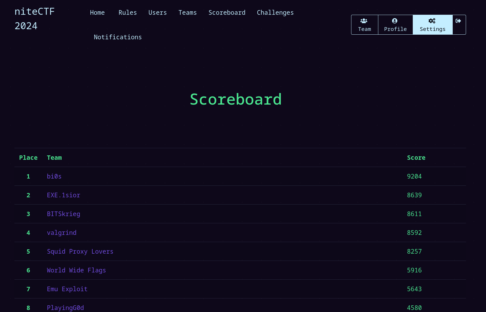
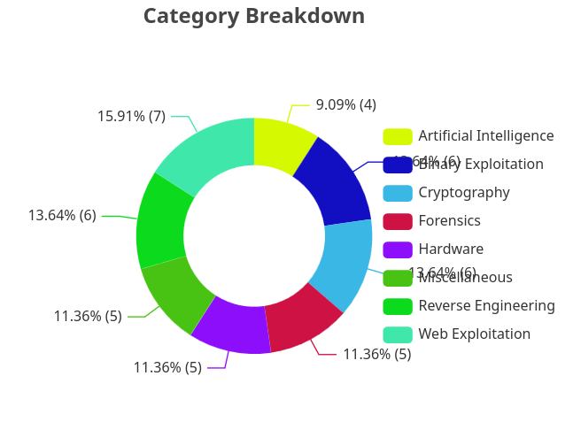
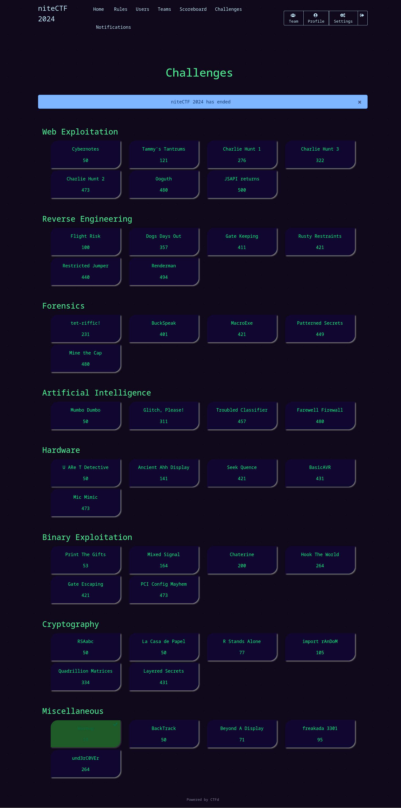

# niteCTF 2024

This repository contains official **source code** and **writeups** for challenges from [niteCTF 2024](https://ctftime.org/event/2461).

### Statistics

| Metric                                  | Value |
| --------------------------------------- | ----- |
| Total Registered Players                | 3243  |
| Total Registered Teams                  | 1464  |
| Teams that solve at least one challenge | 393   |
| Total Number of Challenges              | 43    |

