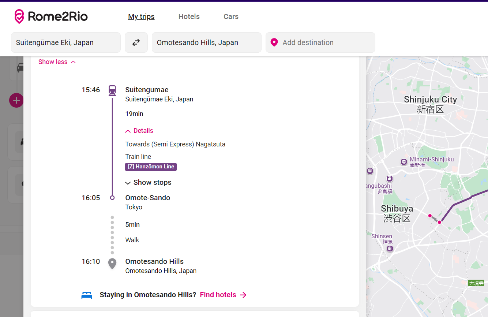
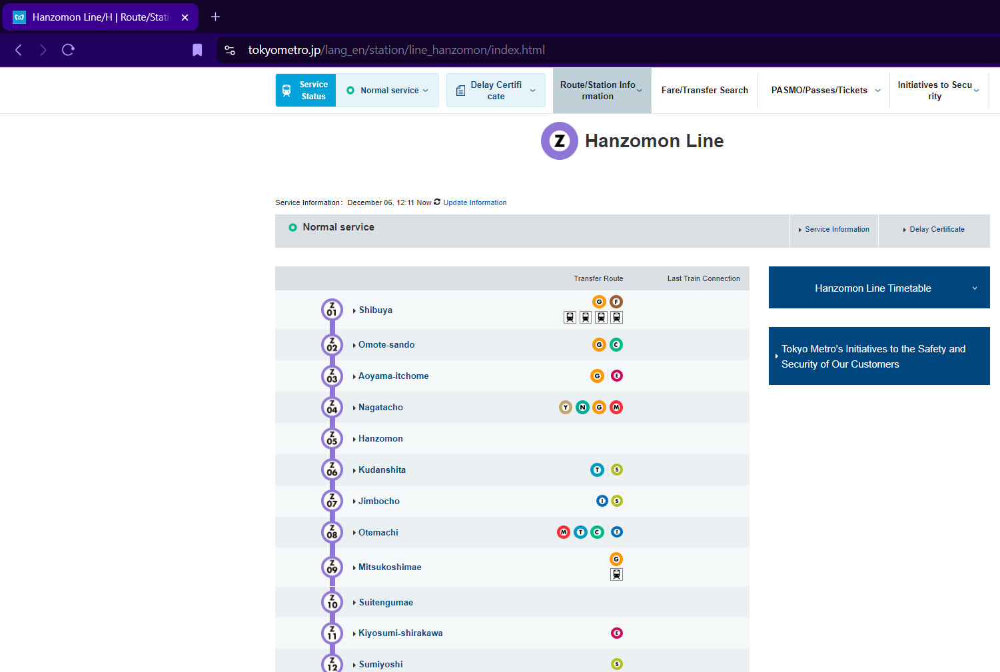
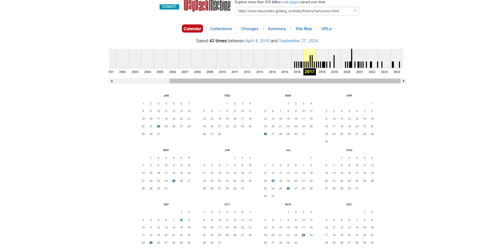
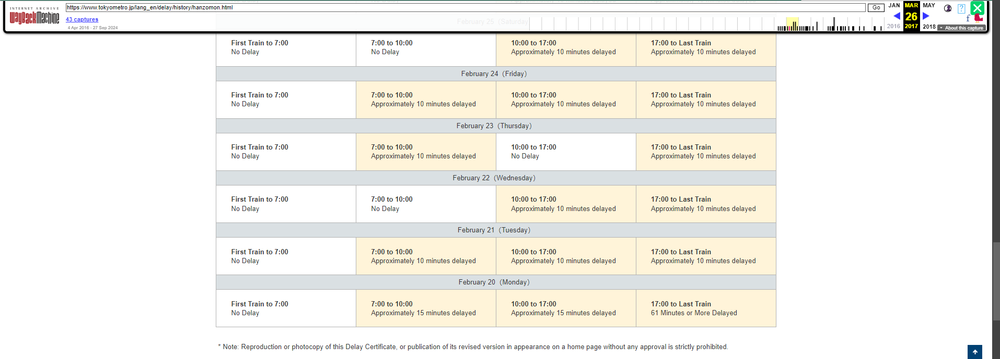

# BackTrack Solution

Kenji is a nice guy who lives in Tokyo. He is in a dilemma. In 2017, he was late to an important meeting and is now facing repercussions. To defend himself, he needs to prove that it was not his fault. His evidence? The train he boarded that day, traveling between Omotesandō and Suitengumae, was delayed. However, his boss is not providing the specific details of the accusation. Kenji vividly remembers one key fact: the train was around 61 minutes late.

Help him uncover the exact date of the incident and the start time of the delay. Justice for Kenji!

Flag Format:
nite{time_date}
Example: nite{13:00_3January}

Looking at the question first, we read that a train in Tokyo has been delayed between Omotesando and Suitengumae. Thus, we can find out the line which services between these two stations.

As we can see in the image, it says the Hanzomon line.

If we search for Hanzomon line in the web, we get:

As the train has been delayed, we see a tab called Delay Certificate, and navigate to the Hanzomon line. However, we can only see approximately the last month's information.

The question asks for the information which dates back to 2017.

As no other information is publicly available for 2017, we can go to the Wayback Machine Archive, copy the Hanzomon Delay Certificate link and paste it.

There are 6 instances in 2017, if we go to each snapshot and search for 61, we can find it in the snapshot of March 26th, 2017.

We scroll down to find the entry as February 20th, 2017.

Thus, the flag is:

nite{17:00_20February}
