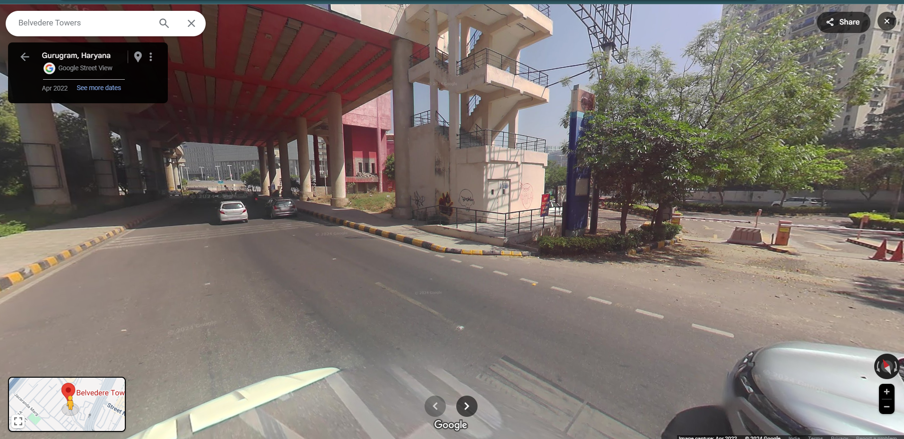
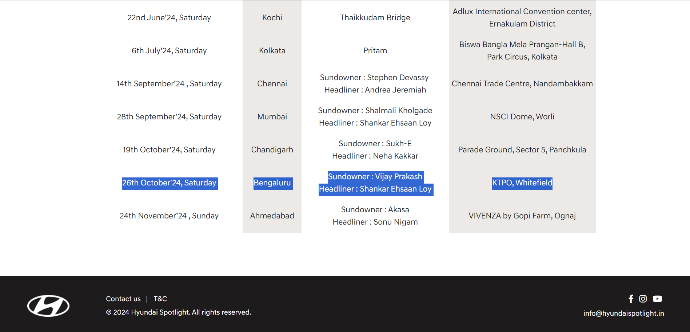

# Beyond A Display

We know that the location of the image is near a metro station. Reverse searching for the image, we get to this link

https://moovitapp.com/index/en/public_transit-Vodafone_Belvedere_Tower-Delhi-stop_34696954-3801

So Belvedere Towers it is. This is the exact location on [Google Maps](https://www.google.co.in/maps/@28.491208,77.0883431,3a,75y,47.91h,103.4t/data=!3m8!1e1!3m6!1sAF1QipN8WG1NczkCVJ54_-ycZXDCVl5GAqsGp17SaFE4!2e10!3e11!6shttps:%2F%2Flh5.googleusercontent.com%2Fp%2FAF1QipN8WG1NczkCVJ54_-ycZXDCVl5GAqsGp17SaFE4%3Dw900-h600-k-no-pi-13.397680205367635-ya98.01470304605925-ro0-fo100!7i7680!8i3840?entry=ttu&g_ep=EgoyMDI0MTIxMS4wIKXMDSoASAFQAw%3D%3D)

The description says `I saw a shopping complex in the vicinity`. If you move a bit forward in the map, you'll see the DLF Cyberhub shopping complex.

Next `I remembered that I saw a multidimensional billboard from a company over there`. So naturally, you search for the keywords "Cyber Hub DLF Multidimensional Billboard". Which will give us this result

https://www.afaqs.com/news/marketing-initiatives/hyundai-earns-spot-in-asia-book-of-records-with-indias-first-4d-billboard-for-the-new-creta

It is India's first 4D billboard.

Moving on, `The same company held a concert on 26th October 2024, and a group performed there`. So on the hunt for the last part, we reach this site: https://hyundaispotlight.in/

Scrolling around a bit we see the band `Shankar Ehsaan Loy` performing in KTPO, Whitefield on 26th October'24, Saturday. So the flag format asks for a venue, KTPO is the venue and Whitefield is a suburb of Bangalore.

Now placing everything in the flag format, we have the flag as **`nite{Hyundai,Shankar_Ehsaan_Loy,KTPO}`**
