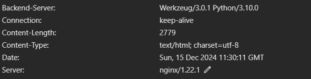
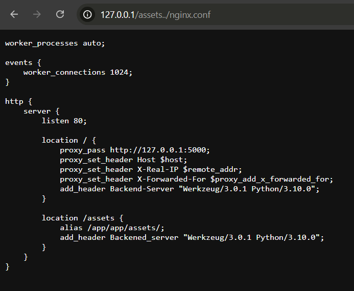
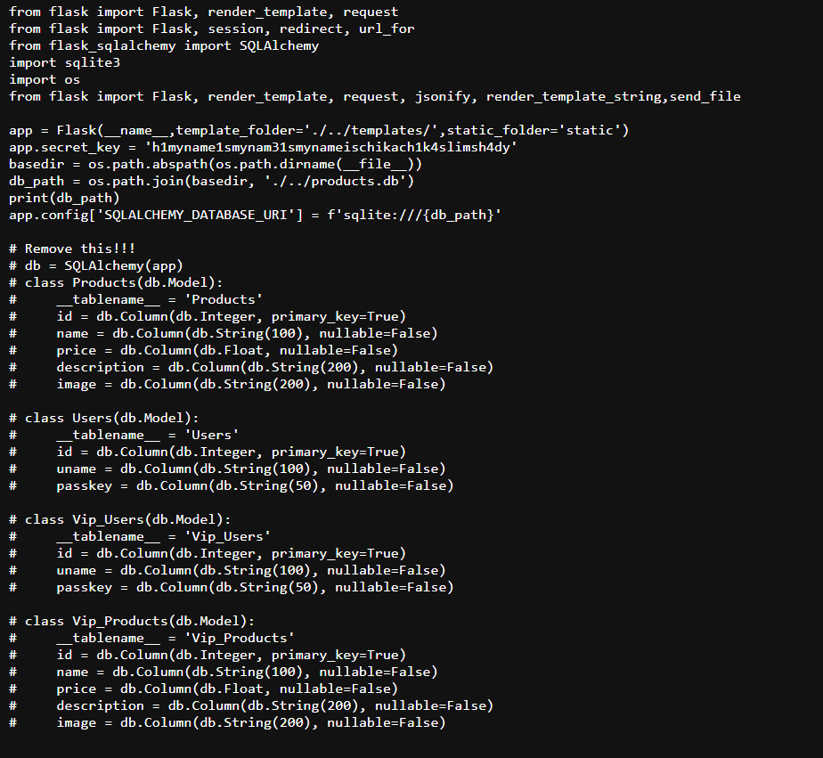
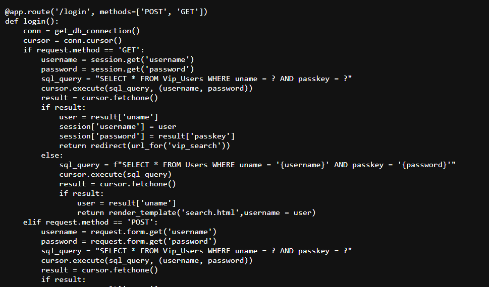
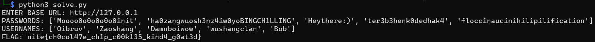
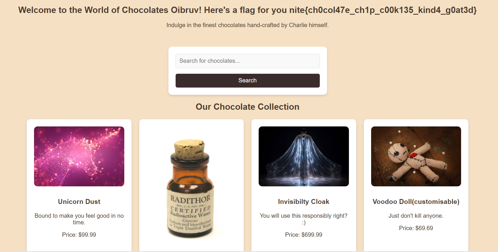

# Charlie Hunt 2 Solution

Looking at the esrver we notice that the server handling the requests is Nginx. Nginx has a very famous vulnerability called the "off-by-slash" where the nginx.conf doesn't have a trailing slash.

This allows us to read files from 1 directory behind. After looking for a endpoint which is serving resources, we see that the images are being served from "./../assets/". Let's try the exploit there as it looks strange. Also as this is running flask, we know that there should be a app.py and we can find the config file as well.

We can see the secret used to generate the cookie. Also, scrolling down, we see that sqli is possible from the session cookie only when we make a get request to the login page. There are some interesting endopints as well, like /vip_search.

Therefore we need to generate a session cookie, make a get request to this endpoint to cause sqli and read details for a vip user and login using that.

Or use the username and password given by the script to login normally

[solve.py](solve.py)
